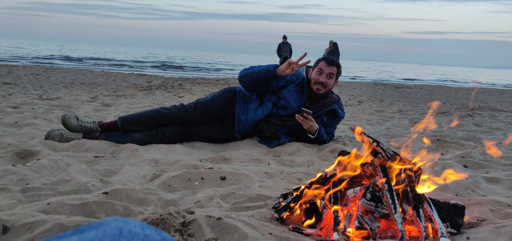

<h1 align="center">Yusuf Mahir Nartok  &mdash; @yousufmahero</h1>
 

Hi! I am Mahir &mdash; an <b>Analytical Consultant</b> at Merkle. Previously, worked as an IT Consultant and Database Developer at Enerjisa E.On|Sabanci. Having 4 years of dynamic experience in IT sector in Agile environment. A <b>backend developer</b> and a <b>machine learning enthusiast</b>. Skilled in Python and realted frameworks, Databases, APIs, and various Cloud Services such as AWS, Azure.
  

<h4>Languages</h4>     

  

<h4>ML/DL stack</h4>   

         

<h3>Github Stats</h3>

 

### 📮 Get In Touch!
[Yusuf Mahir Nartok](mailto:yusufmahirnartok@gmail.com?subject=[GitHub]%20Hi%20Mahir!)

[][linkedin]
[][twitter]

---

[linkedin]: https://www.linkedin.com/in/yusufmahirnartok/
[twitter]: https://twitter.com/YsfMahirNartok/
